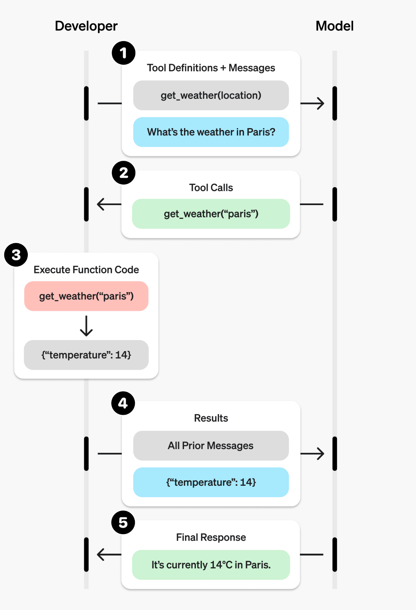

# Function Calling Examples using the Chat Completions API

### Description

Welcome to the Function Calling Examples repository! This collection of Python scripts demonstrates the power and flexibility of the Chat Completions API, specifically focusing on function calling capabilities. Whether you're an AI enthusiast or an engineer, these examples will help you understand and leverage function calling in your projects.

### What is Function Calling?

Function calling allows you to extend the capabilities of language models by integrating custom functions. The model can choose to call these functions based on user input, enabling dynamic and context-aware interactions. This is particularly useful for tasks like retrieving real-time data, performing calculations, or interacting with external APIs.

### Key Features

- **Parallel and Sequential Function Calling**: Learn how to call multiple functions either simultaneously or in a specific order.
- **Generating Prompt Suggestions**: See how the model can suggest prompts based on conversation history.
- **Conversation Summarization**: Automatically summarize chat history to maintain context.
- **Timed Activation of Assistant Behavior**: Implement functions that trigger actions at specific intervals.
- **Asynchronous Programming and Streaming Responses**: Handle complex interactions with asynchronous function calls and real-time streaming responses.
- **JSON Mode**: Utilize JSON Mode for structured outputs and seamless integration with Pydantic classes.

### Documentation

If you are unfamiliar with function calling, here are some resources to get you started:

- [Prompting Guide / function_calling](https://www.promptingguide.ai/applications/function_calling)
- [OpenAI / function-calling](https://platform.openai.com/docs/guides/function-calling)
- [Azure OpenAI / function-calling](https://learn.microsoft.com/en-us/azure/ai-services/openai/how-to/function-calling?tabs=python)
- [Ollama / functions](https://js.langchain.com/docs/integrations/chat/ollama_functions)
- [OpenAI / structured outputs](https://platform.openai.com/docs/guides/structured-outputs)

### Fundamental Steps for Function Calling

The steps in function calling, as represented by numbers 1 through 5 in the image, are as follows:

1. **Tool Definitions + Messages**:  
   The developer defines the tool (e.g., `get_weather(location)`) and sends a message to the model, such as "What's the weather in Paris?"

2. **Tool Calls**:  
   The model identifies the appropriate tool to call and generates a function call, such as `get_weather("paris")`.

3. **Execute Function Code**:  
   The developer executes the function code (e.g., `get_weather("paris")`) and retrieves the result, such as `{"temperature": 14}`.

4. **Results**:  
   The result of the function execution (`{"temperature": 14}`) is sent back to the model, along with all prior messages for context.

5. **Final Response**:  
   The model incorporates the function result into its final response, such as "It's currently 14°C in Paris."




## Examples

- [`func_get_weather.py`](./func_get_weather.py): (**Start here!**) This is a simple program that has a single native function 'get_current_weather' defined. The model is made aware of this function. Given the user's input, it tells us to call the function/tool. Our code invokes our function and then we add the function's response back to the model, supplying it with additional context. Finally, the assistant responds to the user with the temperature in San Francisco, Tokyo, and Paris. This also utilizes **parallel** <u>function calling</u>.
- [`func_get_weather_streaming.py`](./func_get_weather_streaming.py): This is an example of how to <u>**stream**</u> the response from the model while also checking if the model wanted to make a function/tool call. It extends the 'func_get_weather' example.
- [`func_conversation_history.py`](./func_conversation_history.py): This is a simple program that showcases some <u>semantic functionality</u> for: 1) **summarizing conversation history**, 2) providing **prompt suggestions** based on conversation history. This also shows how to utilize using **JSON Mode**.
- [`func_sequential_calls.py`](./func_sequential_calls.py): This serves as an example of **sequential** function calling. In certain scenarios, achieving the desired output requires calling multiple functions in a specific order, where the output of one function becomes the input for another function. By giving the model adequate tools, context and instructions, it can achieve complex operations by breaking them down into smaller, more manageable steps.
- [`func_timing_count_chat.py`](./func_timing_count_chat.py): This example shows how to Do 'X' every 'frequency'. Shows how to <u>**manage state**</u> outside the conversation. There is a function that increments a counter using <u>function calling</u>, counting user inputs before the assistant says something specific to a user. Also shows how to do something once every week by checking if it has been a week and then editing system prompt.
- [`func_structured_outputs.py`](./func_structured_outputs.py): This script demonstrates how to parse raw text into structured JSON using GPT-4o. It includes Pydantic classes for defining the structure and prints the parsed menu in a formatted way.
- [`func_async_streaming_chat.py`](./func_async_streaming_chat.py): an example script that demonstrates handling of <u>asynchronous</u> client calls and <u>streaming</u> responses within a <u>chat loop</u>. It supports <u>function calling</u>, enabling dynamic and interactive conversations. This script is designed to provide a practical example of managing complex interactions in a chat-based interface.
- [`func_async_streaming_chat_server.py`](./func_async_streaming_chat_server.py): (**Most complicated**) an extension of the 'func_async_streaming_chat' script. It not only handles <u>asynchronous</u> client calls, <u>function calling</u>, and <u>streaming</u> responses within a <u>chat loop</u>, but also demonstrates an example of how to <u>format and handle server-client</u> payloads effectively. This script provides a practical example of managing complex interactions in a chat-based interface while ensuring proper communication between the server and client.

## Usage

To use this project, follow these steps:

1. **Clone the Repository**: 
    ```bash
    git clone <repository-url>
    ```
2. **Navigate to the Project Directory**: 
    ```bash
    cd <project-directory>
    ```
3. **Set Up a Python Virtual Environment and Activate It**: 
    ```bash
    python3 -m venv env
    source env/bin/activate
    ```
4. **Install the Required Packages**: 
    ```bash
    pip install -r requirements.txt
    ```
5. **Copy the [`.env.sample`](.env.sample) File to a New File Called `.env`**: 
    ```bash
    cp .env.sample .env
    ```
6. **Configure the Environment Settings**:
   - For Azure OpenAI:
        ```bash
        API_HOST=azure
        AZURE_OPENAI_ENDPOINT=https://<YOUR-AZURE-OPENAI-SERVICE-NAME>.openai.azure.com
        AZURE_OPENAI_API_KEY=<YOUR-AZURE-OPENAI-API-KEY>
        AZURE_OPENAI_API_VERSION=2024-08-01-preview
        AZURE_OPENAI_DEPLOYMENT_NAME=<YOUR-AZURE-DEPLOYMENT-NAME>
        ```
   - For OpenAI.com:
        ```bash
        API_HOST=openai
        OPENAI_KEY=<YOUR-OPENAI-API-KEY>
        OPENAI_MODEL=gpt-4
        ```
   - For Ollama:
        ```bash
        API_HOST=ollama
        OLLAMA_ENDPOINT=http://localhost:11434/v1
        OLLAMA_MODEL=llama2
        ```
7. **Run the Project**: 
    ```bash
    python <program.py>
    ```

### Opening in VS Code

1. **Navigate to the Parent of the Project Directory**: 
    ```bash
    cd ..\<project-directory>
    ```
2. **Open in VS Code**: 
    ```bash
    code <project-folder-name>
    ```

## Contributing

Contributions are welcome! If you would like to contribute to this project, please follow these guidelines:

1. **Fork the Repository**
2. **Create a New Branch**: 
    ```bash
    git checkout -b <branch-name>
    ```
3. **Make Your Changes and Commit Them**: 
    ```bash
    git commit -m 'Add some feature'
    ```
4. **Push to the Branch**: 
    ```bash
    git push origin <branch-name>
    ```
5. **Submit a Pull Request**

## License

This project is licensed under the [MIT License](LICENSE).
